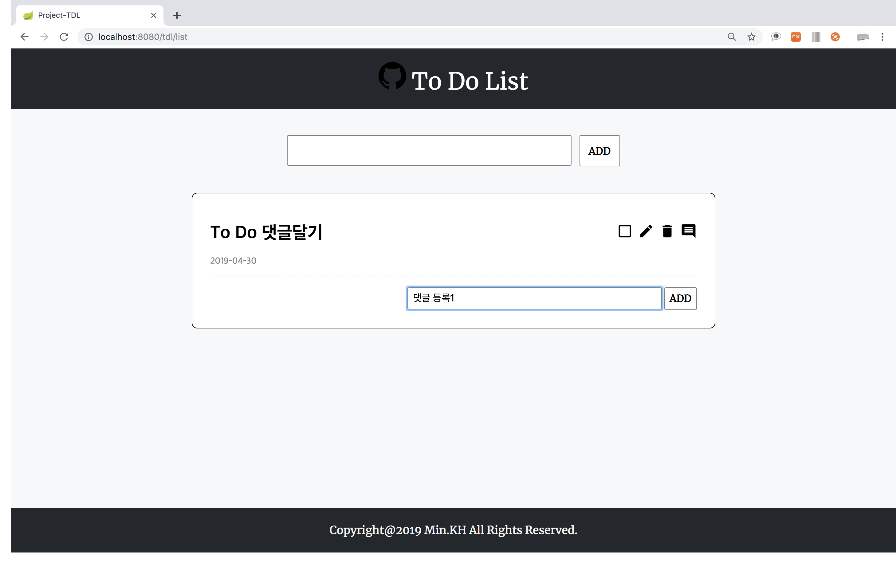

# Project-TDL

## 목차
1. [목적](#목적)
2. [개발환경](#개발환경)
3. [API 스펙 & 도메인 설명](#API 스펙 & Domain 설명)
4. [주요기능](#주요기능)

## 목적
- Spring Boot & JPA 학습 및 Web Application(To Do List) 개발
- Spring Security 학습 및 로그인, 회원가입 구현
- JUnit을 이용한 테스트 코드 학습 및 작성

## 개발환경
|도구|버전|
|:---:|:---:|
|Spring|Spring Boot 2.1.3.RELEASE
|운영체제|Mac OS X|
|개발 툴|IntelliJ IDEA Ultimate 2018.3|
|JDK|JDK 8|
|데이터베이스|MySQL 8.0.3|
|빌드 툴|Gradle 5.2.1|

## [API 스펙 & Domain 설명](https://www.notion.so/Project-TDL-500fb871c36f463a9cb2e3877e388e12)

## 주요기능

### 1. 로그인 화면

#### 1.1. 로그인 검사

### 2. 회원가입 화면

#### 2.1. 아이디 검사

#### 2.2. 이메일 검사

#### 2.3. 비밀번호 검사

### 3. 초기 화면

### 4. To Do 등록

### 5. To Do 완료

### 6. To Do 삭제

### 7. To Do 수정

### 8. 댓글 등록

### 9. 댓글 수정

### 10. 댓글 삭제

### 11. 아이디 찾기

### 12. 비밀번호 찾기

