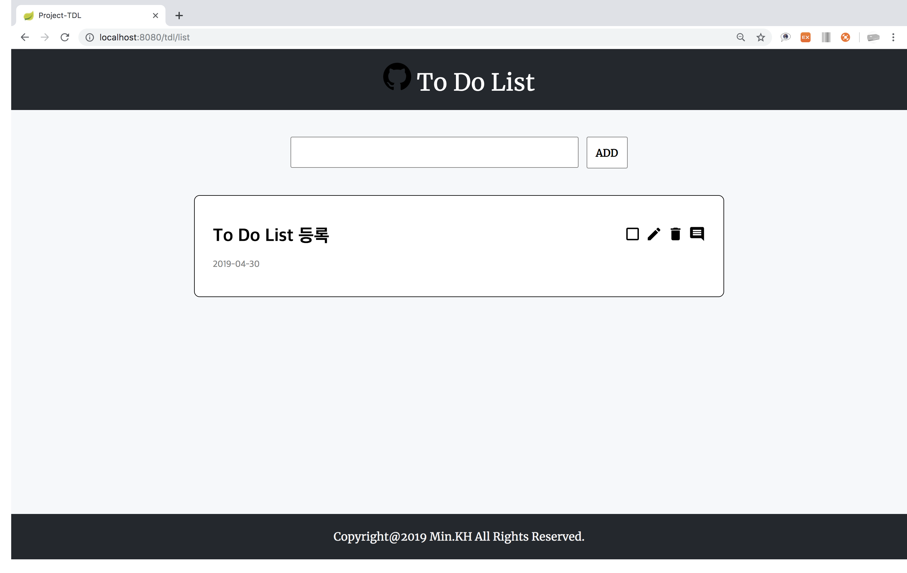
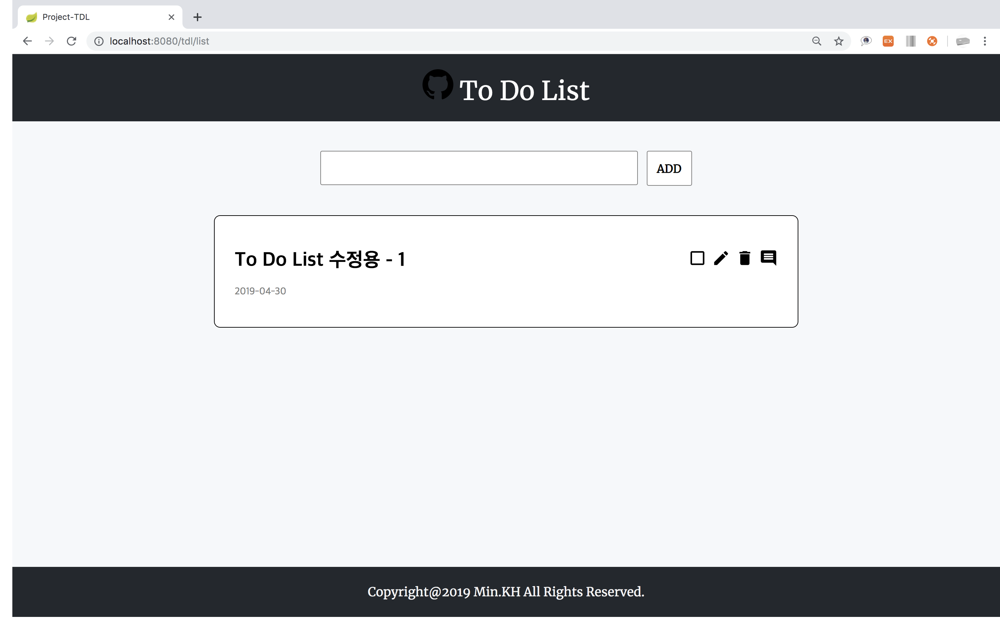
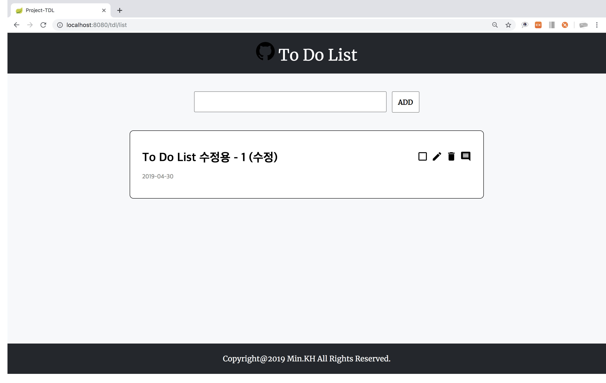

# Project-TDL
스프링 부트를 이용한 To Do List 프로젝트

## 개발환경
|도구|버전|
|:---:|:---:|
|Spring|Spring Boot 2.1.3.RELEASE
|운영체제|Mac OS X|
|개발 툴|IntelliJ IDEA Ultimate 2018.3|
|JDK|JDK 8|
|데이터베이스|MySQL 8.0.3|
|빌드 툴|Gradle 5.2.1|

## 학습과정
### 1일차
- [프로젝트 생성 오류](./img/1.jpeg) / 해결 : IntelliJ 2018.3 다운로드
- TDL 클래스 설계
  1. 키(`idx`) - Integer
  2. 내용(`description`) - String
  3. 완료 여부(`status`) - Boolean
  4. 생성 시간(`createdDate`) - LocalDateTime
  5. 완료 시간(`completedDate`) - LocalDateTime
- 프로젝트 생성

### 2일차
- 도메인 클래스, 저장소 생성(`ToDoList.java`, `ToDoListRepository.java`)
- MySQL 연결 및 테스트(`build.gradle`, `application.yml`)
  1. Schema(`tdl_db`), User(`tdl_user`) 생성
  2. TimeZone 설정 : `url: jdbc:mysql://127.0.0.1:3306/tdl_db?serverTimezone=Asia/Seoul`
  3. 데이터 삽입 및 [확인](./img/2.png)
- 컨트롤러 생성(`ToDoListController.java`)
  - 서비스 호출 및 View 생성(`list.html`)
- 서비스 생성(`ToDoListService.java`)
  - 저장소 호출 및 데이터 반환
- [View 확인](./img/3.png)
- [View 꾸미기](./img/4.png) : Boot Strap 활용
  1. css 적용 시, 경로는 `/static/css`가 아니라 `/css`로 경로 설정
  2. `<meta http-equiv="Content-Type" content="text/html; charset=utf-8"/>`
  3. `<link rel="stylesheet" href="/css/bootstrap.min.css"/>`
- [IntelliJ, MySQL 연동](./img/5.png)

### 3일차
- [View 수정](./img/6.png)

### 4일차
- [View 수정](./img/7.png)

### 5일차
- footer 생성
- 폼 생성 및 등록 함수 생성(`postTDL`)
  1. input text 값 받아오기(`@RequestBody`, `MultiValueMap`)
  2. 서비스 호출 및 등록 로직 처리(`toDoListService.postList()`)
  3. DataBase 저장 및 redirect

### 6일차
- `idx` 속성 값 지정
  1. `delete`, `update`, `status` 버튼 idx value 지정
  2. `<script>` 코드 작성
      1. 반복되는 버튼 이므로 `class` 선택자 사용
      2. 현재 객체의 idx 값을 받아야 하므로 `$(this).val()` 사용
      3. `DELETE` 타입 설정
- 삭제 함수 생성(`deleteTdl`)
  1. idx값 받아오기(`@PathVariable`)
  2. 서비스 호출 및 삭제 함수 생성(`deleteList`)
      - 저장소 호출, 해당 idx 삭제
- 완료 함수 생성(`statusTdl`)
  1. idx값 받아오기(`@PathVariable`)
  2. 서비스 호출 및 완료 함수 생성(`completeList`)
      1. idx값에 해당하는 `ToDoList` 객체 불러오기
      2. 객체 업데이트 함수 생성(`updateStatus`)
          - `status` 및 `completedDate` 업데이트
- [View 완성](./img/8.png)

### 7일차
- Ajax 통신 객체 생성
  1. url : Controller의 `@PutMapping` 경로
  2. type : `PUT`
  3. data : 수정 할 `description`
  4. contentType: `application/json`
  5. dataType : `text`
- 수정 함수 생성(`updateTdl`)
  1. idx값 받아오기(`@PathVariable`)
  2. 수정 할 description 받아오기(`@RequestBody`)
  3. 서비스 호출 및 수정 함수 생성(`updateList`)
      1. idx값에 해당하는 `ToDoList` 객체 불러오기
      2. 객체 업데이트 함수 생성(`update`)
          - `description` 업데이트

### 8일차
- User, TDL - 1:N관계 설정하기
- User 클래스 생성
  1. 키(`idx`) - Integer
  2. 아이디(`id`) - String
  3. 비밀번호(`password`) - String
  4. 이메일(`email`) - String
  6. `OneToMany` : ToDoList(`toDoList`) - ToDoList
- TDL 클래스 User 필드 추가
  - `ManyToOne` : 유저(`user`) - user
- 빌드 실패

### 9일차
- User, TDL - 1:1관계 설정 해보기
  1. ToDoList 클래스 User필드 추가
  ~~~java
  @OneToOne(fetch = FetchType.LAZY)
  private User user;Â
  ~~~
  2. User 객체 생성 후 DB 삽입(`CommandLineRunner`)
- User Controller, Repository, Service 생성
- ToDoListController 클래스 수정
  1. 현재 User의 정보에 대한 User 필드 생성
  `private User user;`
  2. list() 함수 실행 시 User가 null 이면 : User 객체 불러오기
  3. 서비스 호출 및 현재 User와 등록 할 ToDoList 객체 넘기기
- [User 객체 저장](./img/20.png)

### 10일차
- 로그인
  1. `LoginController` 생성
  2. [로그인 View(`login.html`)](./img/21.png) 생성
- 회원가입
  1. `RegisterController`생성
  2. [회원가입 View(`register.html`)](./img/22.png) 생성
  3. `id`, `email`, `pwd`를 포함한 Ajax 객체 생성, 회원가입 유저 DB 저장
- 로그인 확인
  1. `id`, `pwd` Ajax 객체 생성 후 데이터 전송
  2. 서비스 호출 및 `id`, `pwd` 체크 함수 생성(`loginCheck`)
  3. 로그인 확인
      1. `id`가 없을 경우 : 실패
      2. `id`가 있을 경우, `pwd` 확인
          1. `pwd` 일치 : 성공(`redirect list`)
          2. `pwd` 불일치 : 실패

### 11일차
- 로그인 성공 여부에 따라 `redirect` 설정
- 현재 유저에 따라 `to_do_list` 테이블에 `user_idx` [저장](./img/23.png)
- 로그인한 유저가 작성한 `ToDoList` 출력

### 12일차
- `ManyToOne`, `OneToMany` 설정
  - `FK`를 들고 있는 소유권이 있는 클래스에 `@ManyToOne` 어노테이션
  - 소유권이 없는 클래스에 `@OneToMany` 어노테이션 및 `mappedBy` 소유권이 있는 클래스의 변수명
  - 소유권이 없는 클래스는 `Collections`로 지정한다.
  1. `ToDoList` 클래스가 `FK`로 `User` 포함

  |idx|completedDate|createdDate|description|status|user_idx|
  |:---:|:---:|:---:|:---:|:---:|:---:|

  ~~~java
  public Class ToDoList{

    // more filed

    @ManyToOne
    private User user;
  }
  ~~~
  ~~~java
  public class User{

    // more field

    @OneToMany(mappedBy = "user")
    private List<ToDoList> toDoLists;
  }
  ~~~
  2. `User` 클래스가 `FK`로 `ToDoList` 포함

  |idx|email|id|pwd|to_do_list_idx|
  |:---:|:---:|:---:|:---:|:---:|

  ~~~java
  public Class ToDoList{

    // more filed

    @OneToMany(mappedBy = "toDoList");
    private List<User> user;
  }
  ~~~
  ~~~java
  public class User{

    // more field

    @ManyToOne
    private ToDoList toDoList;
  }
  ~~~
  3. `User`가 `FK`로 `ToDoList`를 소유하고 있을 경우 `ToDo`가 등록됨에 따라 불필요하게 중복된 `User`의 정보가 삽입된다.

  |idx|email|id|pwd|to_do_list_idx|
  |:---:|:---:|:---:|:---:|:---:|
  |1|test@ks.ac.kr|test1|12345|1|
  |1|test@ks.ac.kr|test1|12345|2|
  |...|...|...|...|...|
  |1|test@ks.ac.kr|test1|12345|200|

  |idx|completedDate|createdDate|description|status|
  |:---:|:---:|:---:|:---:|:---:|:---:|
  |1|-|Time()|description1|false|
  |2|Time()|Time()|description2|true|
  |...|...|...|...|...|
  |200|-|Time()|description200|true|

  4. `ToDoList`가 `FK`로 `User`를 소유하고 있을 경우 `ToDo`가 등록되어도 하나의 `User` 정보를 유지할 수 있다.
  

## 주요 기능
### 1. 로그인 화면

### 2. 회원가입 화면

### 3. 초기 화면

### 4. To Do 등록

### 5. To Do 완료

### 6. To Do 삭제

### 7. To Do 수정

