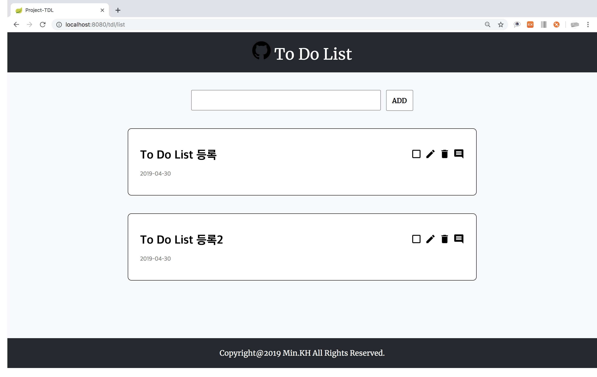
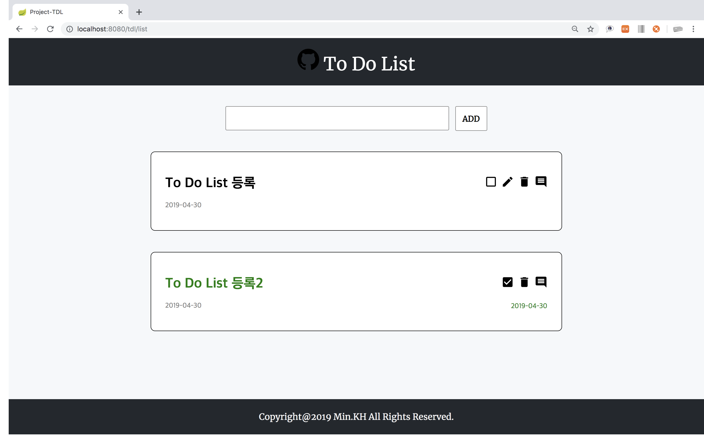
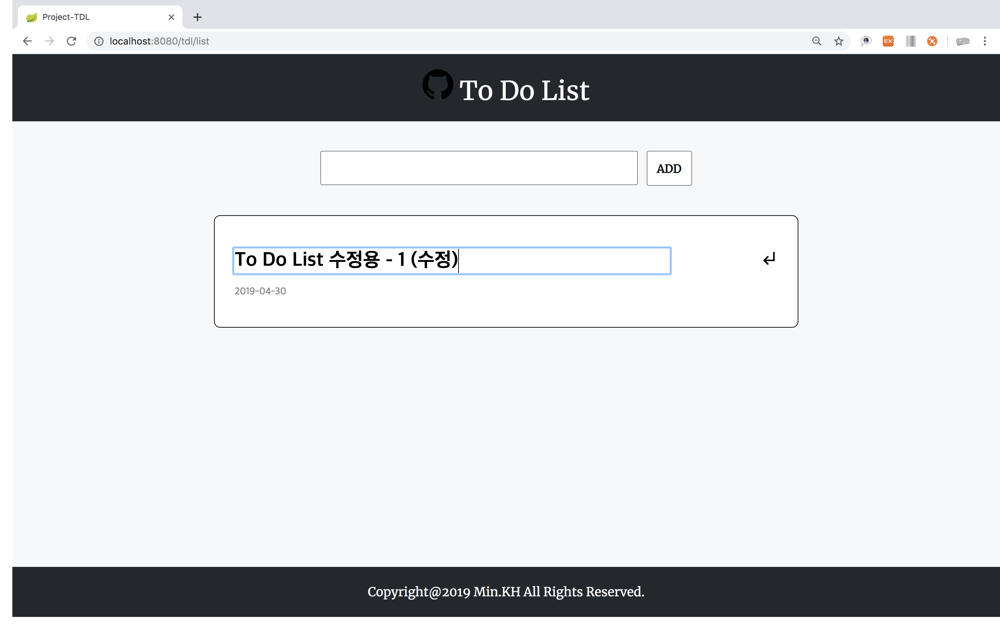
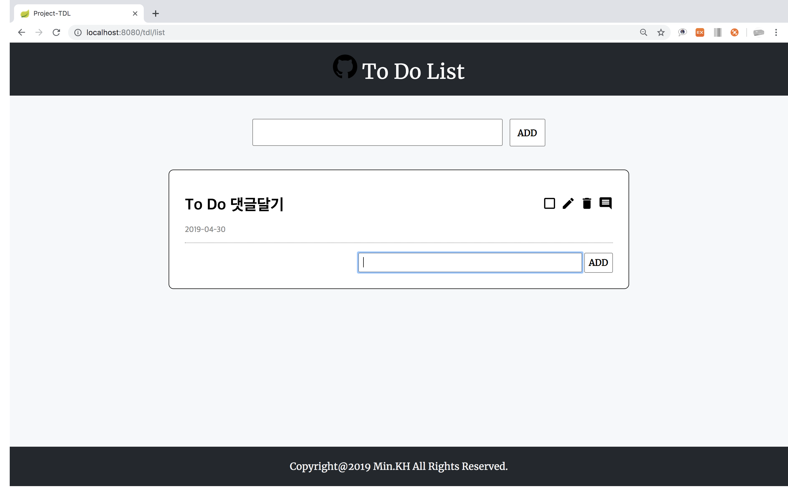

# Project-TDL
- 참여인원 : [민경환](https://www.github.com/ber01), [박동현](https://www.github.com/pdh6547), [신무곤](https://www.github.com/mkshin96), [신재홍](https://www.github.com/woghd9072), [양기석](https://www.github.com/yks095), [엄태균](https://www.github.com/etg6550), [임동훈](https://www.github.com/dongh9508), [최광민](https://www.github.com/rhkd4560), [하상엽](https://www.github.com/hagome0)

## 목차
1. [목적](#목적)
2. [개발환경](#개발환경)
3. [학습과정](#학습과정)
4. [주요기능](#주요기능)

## 목적
- Spring Boot & JPA 학습 및 Web Application(To Do List) 개발
- Spring Security 학습 및 로그인, 회원가입 구현

## 개발환경
|도구|버전|
|:---:|:---:|
|Spring|Spring Boot 2.1.3.RELEASE
|운영체제|Mac OS X|
|개발 툴|IntelliJ IDEA Ultimate 2018.3|
|JDK|JDK 8|
|데이터베이스|MySQL 8.0.3|
|빌드 툴|Gradle 5.2.1|

## 학습과정

### 1일차
- [프로젝트 생성 오류](./img/1.jpeg) / 해결 : IntelliJ 2018.3 다운로드
- TDL 클래스 설계
  1. 키(`idx`) - Integer
  2. 내용(`description`) - String
  3. 완료 여부(`status`) - Boolean
  4. 생성 시간(`createdDate`) - LocalDateTime
  5. 완료 시간(`completedDate`) - LocalDateTime
- 프로젝트 생성
---
### 2일차
- 도메인 클래스, 저장소 생성(`ToDoList.java`, `ToDoListRepository.java`)
- MySQL 연결 및 테스트(`build.gradle`, `application.yml`)
  1. Schema(`tdl_db`), User(`tdl_user`) 생성
  2. TimeZone 설정 : `url: jdbc:mysql://127.0.0.1:3306/tdl_db?serverTimezone=Asia/Seoul`
  3. 데이터 삽입 및 [확인](./img/2.png)
- 컨트롤러 생성(`ToDoListController.java`)
  - 서비스 호출 및 View 생성(`list.html`)
- 서비스 생성(`ToDoListService.java`)
  - 저장소 호출 및 데이터 반환
- [View 확인](./img/3.png)
- [View 꾸미기](./img/4.png) : Boot Strap 활용
  1. css 적용 시, 경로는 `/static/css`가 아니라 `/css`로 경로 설정
  2. `<meta http-equiv="Content-Type" content="text/html; charset=utf-8"/>`
  3. `<link rel="stylesheet" href="/css/bootstrap.min.css"/>`
- [IntelliJ, MySQL 연동](./img/5.png)
---
### 3일차
- [View 수정](./img/6.png)
---
### 4일차
- [View 수정](./img/7.png)
---
### 5일차
- footer 생성
- 폼 생성 및 등록 함수 생성(`postTDL`)
  1. input text 값 받아오기(`@RequestBody`, `MultiValueMap`)
  2. 서비스 호출 및 등록 로직 처리(`toDoListService.postList()`)
  3. DataBase 저장 및 redirect
---
### 6일차
- `idx` 속성 값 지정
  1. `delete`, `update`, `status` 버튼 idx value 지정
  2. `<script>` 코드 작성
      1. 반복되는 버튼 이므로 `class` 선택자 사용
      2. 현재 객체의 idx 값을 받아야 하므로 `$(this).val()` 사용
      3. `DELETE` 타입 설정
- 삭제 함수 생성(`deleteTdl`)
  1. idx값 받아오기(`@PathVariable`)
  2. 서비스 호출 및 삭제 함수 생성(`deleteList`)
      - 저장소 호출, 해당 idx 삭제
- 완료 함수 생성(`statusTdl`)
  1. idx값 받아오기(`@PathVariable`)
  2. 서비스 호출 및 완료 함수 생성(`completeList`)
      1. idx값에 해당하는 `ToDoList` 객체 불러오기
      2. 객체 업데이트 함수 생성(`updateStatus`)
          - `status` 및 `completedDate` 업데이트
- [View 완성](./img/8.png)
---
### 7일차
- Ajax 통신 객체 생성
  1. url : Controller의 `@PutMapping` 경로
  2. type : `PUT`
  3. data : 수정 할 `description`
  4. contentType: `application/json`
  5. dataType : `text`
- 수정 함수 생성(`updateTdl`)
  1. idx값 받아오기(`@PathVariable`)
  2. 수정 할 description 받아오기(`@RequestBody`)
  3. 서비스 호출 및 수정 함수 생성(`updateList`)
      1. idx값에 해당하는 `ToDoList` 객체 불러오기
      2. 객체 업데이트 함수 생성(`update`)
          - `description` 업데이트
---
### 8일차
- User, TDL - 1:N관계 설정하기
- User 클래스 생성
  1. 키(`idx`) - Integer
  2. 아이디(`id`) - String
  3. 비밀번호(`password`) - String
  4. 이메일(`email`) - String
  6. `OneToMany` : ToDoList(`toDoList`) - ToDoList
- TDL 클래스 User 필드 추가
  - `ManyToOne` : 유저(`user`) - user
- 빌드 실패
---
### 9일차
- User, TDL - 1:1관계 설정 해보기
  1. ToDoList 클래스 User필드 추가
  ~~~java
  @OneToOne(fetch = FetchType.LAZY)
  private User user;
  ~~~
  2. User 객체 생성 후 DB 삽입(`CommandLineRunner`)
- User Controller, Repository, Service 생성
- ToDoListController 클래스 수정
  1. 현재 User의 정보에 대한 User 필드 생성
  `private User user;`
  2. list() 함수 실행 시 User가 null 이면 : User 객체 불러오기
  3. 서비스 호출 및 현재 User와 등록 할 ToDoList 객체 넘기기
- [User 객체 저장](./img/20.png)
---
### 10일차
- 로그인
  1. `LoginController` 생성
  2. [로그인 View(`login.html`)](./img/21.png) 생성
- 회원가입
  1. `RegisterController`생성
  2. [회원가입 View(`register.html`)](./img/22.png) 생성
  3. `id`, `email`, `pwd`를 포함한 Ajax 객체 생성, 회원가입 유저 DB 저장
- 로그인 확인
  1. `id`, `pwd` Ajax 객체 생성 후 데이터 전송
  2. 서비스 호출 및 `id`, `pwd` 체크 함수 생성(`loginCheck`)
  3. 로그인 확인
      1. `id`가 없을 경우 : 실패
      2. `id`가 있을 경우, `pwd` 확인
          1. `pwd` 일치 : 성공(`redirect list`)
          2. `pwd` 불일치 : 실패
---
### 11일차
- 로그인 성공 여부에 따라 `redirect` 설정
- 현재 유저에 따라 `to_do_list` 테이블에 `user_idx` [저장](./img/23.png)
- 로그인한 유저가 작성한 `ToDoList` 출력
---
### 12일차
- `ManyToOne`, `OneToMany` 설정
  - `FK`를 들고 있는(소유권이 있는) 클래스에 `@ManyToOne` 어노테이션
  - 소유권이 없는 클래스에 `@OneToMany` 어노테이션 및 `mappedBy` 소유권이 있는 클래스의 변수명
  - 소유권이 없는 클래스는 `Collections`로 지정
- `User` 클래스가 `FK`로 `ToDoList`를 포함할 때

  |idx|email|id|pwd|to_do_list_idx|
  |:---:|:---:|:---:|:---:|:---:|

  ~~~java
  public class User{

    // more field

    @ManyToOne
    private ToDoList toDoList;
  }
  ~~~

  ~~~java
  public Class ToDoList{

    // more filed

    @OneToMany(mappedBy = "toDoList");
    private List<User> user;
  }
  ~~~

  `User`가 `FK`로 `ToDoList`를 소유하고 있을 경우 `ToDo`가 등록됨에 따라 불필요하게 중복된 `User`의 정보가 삽입된다.

  `User_Table`

  |idx|email|id|pwd|to_do_list_idx|
  |:---:|:---:|:---:|:---:|:---:|
  |1|test@ks.ac.kr|test1|12345|1|
  |1|test@ks.ac.kr|test1|12345|2|
  |...|...|...|...|...|
  |1|test@ks.ac.kr|test1|12345|200|

  `ToDoList_Table`

  |idx|completedDate|createdDate|description|status|
  |:---:|:---:|:---:|:---:|:---:|
  |1|-|Time()|description1|false|
  |2|Time()|Time()|description2|true|
  |...|...|...|...|...|
  |200|-|Time()|description200|false|

  `User` 클래스가 `FK`로 `ToDoList`를 포함하는 것은 적합하지 않다.
- `ToDoList` 클래스가 `FK`로 `User`를 포함 할 때

  |idx|completedDate|createdDate|description|status|user_idx|
  |:---:|:---:|:---:|:---:|:---:|:---:|

  ~~~java
  public class User{

    // more field

    @OneToMany(mappedBy = "user")
    private List<ToDoList> toDoLists;
  }
  ~~~
  ~~~java
  public Class ToDoList{

    // more filed

    @ManyToOne
    private User user;
  }
  ~~~

  `ToDoList`가 `FK`로 `User`를 소유하고 있을 경우 `ToDo`가 등록되어도 하나의 `User` 정보를 유지할 수 있다.

  `User_Table`

  |idx|email|id|pwd|
  |:---:|:---:|:---:|:---:|
  |1|test1@ks.ac.kr|test1|12345|
  |2|test2@ks.ac.kr|test2|12345|
  |3|test3@ks.ac.kr|test3|12345|

  `ToDoList_Table`

  |idx|completedDate|createdDate|description|status|user_idx|
  |:---:|:---:|:---:|:---:|:---:|:---:|
  |1|-|Time()|description1|false|1|
  |2|Time()|Time()|description2|true|1|
  |...|...|...|...|...|...|
  |199|Time()|Time()|description199|true|2|
  |200|-|Time()|description200|false|3|

  `ToDoList` 클래스가 `FK`로 `User`를 포함하여야 한다.
---
### 13일차  
- 빌더 패턴을 사용하지 않기 때문에 `@Builder` 및 생성자 삭제
- `ToDoList` 테이블에 `user_idx` 값만 들어가는 것이 아니라 현재 유저 객체(`this.user`)가 자신이 작성한 `ToDoList`를 가지고 있어야 한다.
- `FetchType`을 `LAZY`에서 `EAGER`로 변경한다.
- `List<ToDoList>`에 값을 추가하기 위하여 새로운 리스트를 생성한다.(`new ArrayList<>()`)
- `User` 객체의 `List<ToDoList>` 필드에 저장할 `ToDoList` 를 `add` 한다.
  ~~~java
  public Class User{

  // more field

    @OneToMany(fetch = FetchType.EAGER, mappedBy = "user")
    private List<ToDoList> toDoList = new ArrayList<>();

    public void add(ToDoList toDoList){
        toDoList.setUser(this);
        getToDoList().add(toDoList);
      }
    }
    ~~~
- `tdl/list`로 `redirect`될 때 현재 유저가 가지고 있는 `ToDoList`객체 출력
---
### 14일차
`Spring Security` 적용해보기
- Security 테스트 프로젝트 생성
- `config` 패키지 및 `SecurityConfig` 클래스 생성
- Spring Security 의존성 추가
    ~~~
    dependencies {
        compile 'org.springframework.security:spring-security-web:4.2.7.RELEASE'
        compile 'org.springframework.security:spring-security-config:4.2.7.RELEASE'
        implementation 'org.springframework.boot:spring-boot-starter-web'
        implementation 'org.springframework.boot:spring-boot-starter-thymeleaf'
        testImplementation 'org.springframework.boot:spring-boot-starter-test'
    }
    ~~~
- `WebSecurityConfigurerAdapter` 상속 및 `configure()` 메소드 오버라이딩
- `AuthenticationManagerBuilder` 클래스를 이용하여 인메모리 인증 코드 작성
- `login.html` `index.html` `user/index.html` 추가
- `application.yml` 설정
  ~~~
  server:
    port: 8080

  logging:
    level:
      root: WARN
      org.springframework.web: INFO
      org.springframework.security: INFO

  spring:
    thymeleaf:
      cache: false
  ~~~
- 실패
---
### 15일차
`Spring Security` 적용 재도전 - [참고 사이트](https://spring.io/guides/gs/securing-web/)
- 프로젝트 생성(Security)
- 의존성 설정(`build.gradle`)
  ~~~
  dependencies {
    compile("org.springframework.boot:spring-boot-starter-thymeleaf")
    compile("org.springframework.boot:spring-boot-starter-web")
    testCompile("junit:junit")
    testCompile("org.springframework.boot:spring-boot-starter-test")
    testCompile("org.springframework.security:spring-security-test")
  }
  ~~~
- html 삽입(`home.html`, `hello.html`)
- View Controller 생성(`MvcConfig`) - url에 따라 View(`html`)를 뿌리는 역할
    1. `registry.addViewController("/home").setViewName
    ("home");`
        - `"/home"`일 때, `home.html`을 반환
    2. `registry.addViewController("/").setViewName("home");`
        - `/`일 때, `home.html`을 반환
    3. `registry.addViewController("/hello").setViewName("hello");`
        - `/hello`일 때, `hello.html`을 반환
    4. `registry.addViewController("/login").setViewName("login");`
        - `/login`일 때, `login.html`을 반환
        - `loing.html`을 아직 생성하지 않았기 때문에 반환하지 않고 오류 발생
- 로그인을 하지 않은 사용자가 `hello.html`을 볼 수 없게 설정
  1. `home.html` 에서 링크 클릭 시 login 페이지 이동
  2. 로그인이 된 사용자일 경우 `hello.html` 반환
- Security 사용을 위한 의존성 설정(`build.gradle`) 및 실행
  ~~~
  dependencies {

    // more dependencies
    compile("org.springframework.boot:spring-boot-starter-security")
  }
  ~~~
  1. 인증이 되지 않았기에 모든 url에 인증을 요청하게 됨
  2. 모든 url요청에 대해 Spring Security에서 기본 [로그인 페이지](./img/25.png) 반환
- `WebSecurityConfig` 클래스 생성 후 커스터마이징
  1. `WebSecurityConfigurerAdapter` 상속 및 `configure(HttpSecurity http)` 메소드 오버라이딩
      1. `.authorizeRequests()` : 요청에 대하여 보안을 어떻게 적용할 것인지 설정
      2. `.antMatchers()` : 특정한 패턴에 대해서
          - `antMatchers("/", "/home").permitAll()` : 두 가지 요청에 대해서는 인증을 하지 않아도 뷰를 보여줌
          - 일반적인 프로그램은 `css`, `js`등 도 존재하기에 이에 대한 요청도 허용 하여야 한다.
      3. `.anyRequest()` : 나머지 모든 요청들에 대해서는
      4. `.authenticated()` : 인증이 필요함을 명시
      5. `.formLogin()` : form 로그인과 관련된 설정
          - `.loginPage("/login")` : 로그인 페이지로 가는 `request` 설정
          - `.loginPage("/login").permitAll()` : 모든 사용자가 인증 없이 로그인 페이지로 이동 가능
      6. `.logout()` : 로그아웃에 관한 설정
  2. `userDetailsService()` 메소드 오버라이딩
      1. `UserDetails user` : 유저 객체 생성
          - `.withDefaultPasswordEncorder()` : 패스워드 인코딩 설정
          - `.userName()` : 이름 설정
          - `.password()` : 패스워드 설정
          - `.roles()` : 권한 설정
          - `new InMemoryUserDetailsManager(user)` 인메모리 방식으로 유저 저장
      2. `login.html` 생성
      3. `hello.html` 변경 : 로그인(인증) 사용자에 대한 정보 표시, 로그아웃 버튼 추가
- 출력 화면      
  1. `"/"`, `"/home"` [화면](./img/26.png)
  2. `"/login"` [화면](./img/27.png)
  3. 로그인(인증) 후 `"/hello"` [화면](./img/28.png)
  4. 로그아웃 후 `"/login?logout"` [화면](./img/29.png)
---
### 16일차
`Spring security`를 이용한 구체적인 사용자 생성 - [참고 영상](https://www.youtube.com/watch?v=fG21HKnYt6g), [참고 사이트](https://docs.spring.io/spring-security/site/docs/5.0.2.BUILD-SNAPSHOT/reference/htmlsingle/#core-services-password-encoding)
- 의존성 추가(JPA, lombok)
  ~~~
  dependencies {  
    implementation 'org.springframework.boot:spring-boot-starter-data-jpa'
    annotationProcessor 'org.projectlombok:lombok'  
  }
  ~~~
- `user` 패키지 생성
  1. `User` 클래스 생성
      - `idx(Integer)`, `email(String)`, `password(String)` 필드 생성
  2. `UserController` 클래스 생성
      - 임의의 사용자를 생성하는 `create()` 메소드 생성
  3. `UserRepository` 인터페이스 생성
      - 생성된 유저를 DB에 저장
  4. `UserService` 클래스 생성
      - `UserDetailsService()` 인터페이스 상속 및 `loadUserByUsername()` 메소드 오버라이딩
        1. `UserRepository`를 이용하여 유저 불러오기
        2. `UserDetails` 클래스로 유저 캐스팅
- 실행 : [에러](./img/30.png)
- 패스워드 인코딩
  1. `WebSecurityConfig` 클래스에 `PasswordEncorder` 속성 추가
  2. `PasswordEncorder.encode()` 메소드를 이용하여 패스워드 인코딩 및 [저장](./img/31.png)
- `UserDetails` 축소 - `UserDetails`를 상속받는 `User` 클래스 사용
- `Spring Security` 테스트 프로젝트 종료
---
### 17일차
`ToDoList` 프로젝트에 `Spring Security` 적용하기
- `Spring Security` 의존성 추가
  ~~~
  dependencies {  
    implementation 'org.springframework.boot:spring-boot-starter-security'
    testImplementation 'org.springframework.security:spring-security-test'
  }
  ~~~
- `config` 패키지 생성 및 `SecurityConfig` 클래스 생성
  1. `WebSecurityConfigurerAdapter` 클래스 상속
  2. `configure(HttpSecurity http)` 메소드 오버라이드
      - 각종 `HttpSecurity` 추가
      - `Spring Security` 적용 시 `csrf` 를 해제해줘야 `POST`가 정상작동 하므로 `csrf().disable()`을 꼭 추가
      - `successForwardUrl()` 유저가 성공적으로 인증 완료 후 이동 할 위치 지정(해당 메소드는 `POST`)
  3. 패스워드 인코딩 메소드 `passwordEncoder()` 생성
- `UserService` 클래스 `UserDetailsService` 상속
  1. `loadUserByUsername()` 메소드 오버라이드
  2. 패스워드 인코딩 후 저장하는 `pwdEncoding()` 메소드 구현
  3. `RegisterController` 에서 `UserService` 호출 및 `id`, `email`, `pwd` 값 받아오기
  4. 유저 회원가입 및 DB [등록](./img/32.png)
- Security 로그인은 `loadUserByUsername(String id)` 메소드가 자동으로 호출
- `login.html` 수정
  1. js 삭제 후 form 형태로 변경
  2. form 값을 받아올 `login_id`, `login_pwd` name 속성 지정
- 로그인 성공

Spring Security를 사용하여 `username` 가져오기
- 로그인 성공이 되었을 때(`/tdl/list` 로 `redirect` 되었을 때) 현재 세션 사용자의 정보 받아오기
  1. `SecurityContextHolder.getContext().getAuthentication().getPrincipal()` : Security User 객체 반환
  2. `getName()` : Security User의 `username` 반환
- 현재 세션 사용자의 정보를 이용하여 도메인 `User` 생성
  1. 서비스 호출 및 `findCurrentUser()` 메소드 실행 : Secyrity `username`을 이용하여 도메인 `user` 반환
  2. 서비스 호출 및 `findCurrentUserToDoList()` 메소드 실행 : 현재 `user`가 작성한 `ToDoList` 반환
---
### 18일차
회원가입 관련 로직 추가
- 아이디, 이메일, 비밀번호 미기재 시 회원가입 불가능 하게 변경(`register.js`)
- 아이디 중복 검사
  1. 중복 버튼 생성(`register.html`)
  2. 버튼 클릭 시 입력 id값 전송(`register.js`)
      - Ajax 객체 생성 후 반환
        1. url: "/register/duplication"
        2. type: "POST"
        3. data: 입력 id 값,
        4. contentType: "application/json",
        5. dataType: "text"
  3. `RegisterController` 중복 체크 함수 추가 : `idDuplication()`
      - `register/duplication` 경로는 허용되지 않기에 `antMatchers()` 함수에 `/register/**` 패턴을 추가한다.
      1. 서비스 호출 및 중복 체크 함수 실행 : `duplicationCheck()`
      2. 저장소 호출 및 입력 id 조회
---
### 19일차
유효성 체크(`validation`) 적용
- `User` 테이블의 컬럼 `id`, `email`, `pwd`에 어노테이션 추가
  1. 모든 컬럼은 `null` 값 X : `@Column(nullable = false)`
  2. 컬럼에 빈칸 입력 X : `@NotEmpty`
  3. `email` 컬럼은 이메일 형식으로 입력 : `@Email`
- `postRegister()` 메소드 수정
  1. 입력에 대한 유효성 검사를 위한 `@Valid` 어노테이션 추가
  2. `User` 클래스에 제약을 걸었기에 매개변수를 `Map`에서 `User`로 변경
  3. `error`를 받아오는 `BindingResult` 매개변수 추가
  4. 에러메시지 출력
---
### 20일차
알게 된 사실
  1. `@Column(nullable = false)`를 사용하면 `Not null` 제약이 적용 된다.
  2. `register`를 할 때 `id`에 값을 입력하지 않고 전송하여도 `User`가 생성된다.
  3. 이 때 전송된 `id`값은 `null`이 아니라 `Empty Value`이다.
  4. 테이블 생성 제약을 어긴것이 아니라 `DB`의 `id`값에 `Empty Value`가 저장된 것이다.

유효성 체크(`validation`) 적용 II
- 데이터 전송 및 유효성 검사 클래스 `UserDto` 생성
  1. `id`, `email`, `pwd` 필드 생성
  2. `null`, `EmptyValue`, `space`를 허용하지 않는 `@NotBlank` 어노테이션 추가
  3. `UserDto`를 실제 DB에 저장되는 `User`로 변환하는 `toEntity()` 메소드 생성
- `RegisterController`의 `postRegister()` 메소드 수정
  1. `User`로 받아오는 매개변수를 `UserDto`로 수정
  2. `UserService` 호출 및 패스워드 인코딩 & DB 저장 메소드 호출
- `UserService`의 `pwdEncodingAndRegister()` 메소드 수정
  1. `User`로 받아오는 매개변수를 `UserDto`로 수정
  2. `User` 객체로 변환 하는 `toEntity()` 메소드 실행 및 `UserRepository` 호출 후 `DB` 저장
---
### 21일차
유효성 체크(`validation`) 적용 마무리
- `id` : 5~10자의 영문 소문자, 숫자, 중복 검사
  1. `register.js`
      - `/[a-z0-9]{5,10}/g`
  2. `UserDto`
      - `@Pattern(regexp = "[a-z0-9]{5,10}")`
- `email` : Email 형식, 중복 검사
  1. `register.js`
      - `/^[A-Za-z0-9_\.\-]+@[A-Za-z0-9\-]+\.[A-Za-z0-9\-]+/`
  2. `UserDto`
      - `@Email`
- `pwd` : 8~16자 영문 대 소문자, 숫자, 특수문자 1개 이상 혼합
  1. `register.js`
      - `/^(?=.*[a-zA-Z])(?=.*[!@#$%^*+=-])(?=.*[0-9]).{8,16}$/`
  2. `UserDto`
      - ` @Pattern(regexp = "(?=.*[a-zA-Z])(?=.*[!@#$%^*+=-])(?=.*[0-9]).{8,16}")`
---
### 22일차
회원가입 테스트 코드 작성

1. 초기 설정
    - `@AutoConfigureMockMvc`
      - `MockMvc`의 자동 구성을 활성화하고 구성하기 위해 테스트 클래스에 적용하는 어노테이션
    - `MockMvc`
      1. `Web Application Context`(스프링이 관리하는 `Bean`들의 컨테이너)의 모형
      2. Ajax 혹은 client의 Request를 `Controller`가 처리하는 것과 같은 테스트 진행 가능

2. 회원가입, 로그인 페이지 요청(`GET`)
    - `status().isOk()`
      - 응답 상태 코드가 HttpStatus.OK (200)

3. 회원가입 성공(`POST`)
    - `contentType(MediaType.APPLICATION_JSON)`
      - contentType이 `"application/json"` 인지 확인
    - `content()`
      - 요청 본문을 UTF-8 문자열로 설정
    - `ObjectMapper`
      - 기본 POJO와의 JSON 읽기 및 쓰기 기능과 관련 변환 기능 제공
    - `writeValueAsString()`
      - Java 값을 모두 String으로 serialize
    - `status().isCreated()`
      - 응답 상태 코드가 HttpStatus.CREATE (201)

4. 회원가입 오류(`id`, `email`, `pwd`)
    - `status().isBadRequest()`
      - 응답 상태 코드가 HttpStatus.BadRequest (400)
---
### 23일차
계층형 `ToDoList` 만들기

1. 도메인 생성(`Comment`)
    - `Integer` - `idx`
    - `String` -  `content`
    - `LocalDateTime` - `createdDate`
    - `LocalDateTime` - `modifiedDate`

2. 댓글 View [생성](./img/45.png)

---
### 24일차
댓글 등록, 데이터 베이스 저장
1. `Comment`, `ToDoList`, `@ManyToOne`, `@OneToMany` 관계 설정
    - 댓글 테이블에 리스트의 키 값이 있어야 중복 컬럼이 생기지 않는다.
    - `Comment` 클래스에 `ToDoList` 필드 추가
    - `ToDoList` 클래스에 `List<Comment>` 필드 추가
2. 컨트롤러 생성(`CommentController`)
    - `POST` 타입의 `/comment` 요청에 해당하는 메소드 생성
    - 서비스 호출 및 `Comment` 객체 생성 및 등록 메소드 `registerComment()` 호출
3. 서비스 생성(`CommentService`)
    - `Comment` 객체 생성
    - `ToDoListRepository` 호출 및 댓글이 달리는 `ToDoList`의 `idx`로 `ToDoList` 객체 불러오기
    - `ToDoList` 객체와 `Comment` 객체 연결
    - 저장소 호출 및 `Comment` DB 등록
4. 저장소 생성(`CommentRepository`)
5. Ajax 객체 생성(댓글 내용, 해당 todo의 idx) 및 전송 로직 생성(`comment.js`)
6. DB 저장 [성공](./img/46.png)
---
### 25일차
댓글 View 보이게 하기
1. `Comment` 클래스는 `ToDoList` 클래스에 포함
2. `{tdl.commentList}` 를 반복하여 댓글 View 출력

댓글 수정, 삭제
- `ToDoList` 수정, 삭제와 동일
1. 수정
    1. 수정 할 댓글의 `idx`와 내용을 `PutMapping`
    2. `idx`를 이용하여 `Comment` 객체 생성 및 내용, 수정시간 업데이트
2. 삭제
    1. 수정 할 댓글의 `idx` `DeleteMapping`
    2. 해당하는 `idx` 컬럼 삭제
---
### 26일차
1. `ToDoList` 수정 시 완료, 삭제, 댓글 버튼 비활성화
2. 댓글 수정, 삭제 시 페이지 리로드 X
3. 댓글 삭제 시 삭제 버튼 비활성화
---
### 27일차
회원가입 테스트 코드 작성하기
1. `@WebMvcTest`
    1. MVC 관련 설정만 로드하여 컨트롤러를 가볍게 테스트 가능
    2. `@Controller` 는 로드하지만 `@Service`, `@Repository` 는 로드하지 않음
    3. 따라서 의존 객체는 `@MockBean` 어노테이션을 사용하여 생성
2. `@SpringBootTest`
    1. 통합 테스트를 제공하는 어노테이션
    2. `@AutoConfigureMockMvc` 어노테이션과 함께 사용하면 MVC 테스트 가능
3. `ObjectMapper`
    1. `post()` `content()` 의 파라미터를 입력할 때 사용
    1. `POJO` 객체 `Json` 형태로 변환
    2. {\"id\":\"user1\",\"email\":\"user1@ks.ac.kr\",\"pwd\":\"user1A!\"} 형태의 문자열로 파싱
2. `GET` 요청, HTTP 상태값 `200` 반환
3. `ID`, `E-mail`, `PWD` 유효성 검사
4. `ID`, `E-mail` 중복 검사
---
### 28일차
로그인 테스트 코드 작성하기
1. 로그인 실패
    1. 아이디 불일치
        - `/login?error` 리다이렉트
    2. 비밀번호 불일치
        - `/login?error` 리다이렉트
    3. `/tdl/list` 접근
        - `/login` 리다이렉트
2. 로그인 성공
    1. 아이디, 비밀번호 일치
        - `/` 리다이렉트
    2. `/` 요청
        - `/tdl/list` 리다이렉트
    3. `/tdl/list` 요청
        - `/tdl/list` 리다이렉트
3. 세션 존재
4. 쿠키 갱신(?)
---
### 29일차
ToDo 등록 테스트 코드 작성하기
1. `@Before` 설정
    1. `MockMvc` 초기화
    2. 유저 생성 및 `post(/register)` 요청
    3. `UserDetails` 필드 생성 유저로 초기화
    4. `currentUser` 초기화를 위한 `get("/tdl/list")` 요청
2. `get` 요청
    1. `/` 요청
    2. `/tdl/list` 요청
3. 등록 실패
    1. 문자열 길이 0
    2. 문자열 길이 35 이상
4. 등록 성공
    1. 정상 등록
    2. 저장 된 `ToDo` 비교
        1. `ToDoList` 객체 - `Not Null`
        2. `Description` - `일치`
        3. `CreateDate` - `Not null`
        4. `CompletedDate` - `null`
        5. `UserIdx` - `일치`
5. 완료
    1. `ToDo` 등록
    2. 상태(`False`), 완료 날짜(`null`) 확인
    3. `put("/tdl/complete/1")` 요청
    4. 상태(`True`), 완료 날짜(`LocalDateTime.now()`)
6. 삭제
    1. `ToDo` 등록
    2. 등록 `ToDo` 객체 확인(`not null`)
    3. `delte('/tdl/1')` 요청
    4. 삭제 확인(`null`)
7. 수정
    1. `ToDo` 등록
    2. 초기 등록 내용 확인
    3. `put("/tdl/1")` 요청
        - 수정 `description` 삽입
    4. 수정 된 `description` 확인

---
### 30일차
댓글 테스트 코드 작성하기
1. 유저 생성 및 `ToDo` 등록
2. 등록 테스트(`POST`)
    1. 1번 ToDo에 `Comment` 3개 등록
    2. 2번 ToDo에 `Comment` 1개 등록
    3. 3번 ToDo에 `Comment` 2개 등록
    4. ToDo와의 관계성 확인
        - `ToDoListIdx` 에 대한 `List` 의 개수
3. 수정 테스트(`PUT`)
    1. 수정 요청 성공 확인
    2. 수정 시간(`modified_date`) 확인
4. 삭제 테스트(`DELETE`)
    1. 삭제 요청 성공 확인
    2. DB 확인
        - 삭제 한 `idx` 에 대한 `Comment` 객체 `null` 확인
---
### ~
이 후 학습 과정은 [Issue](https://github.com/ber01/Project-TDL/issues)에 설명하고 있습니다.

## 주요기능

### 1. 로그인 화면

#### 1.1. 로그인 검사

### 2. 회원가입 화면

#### 2.1. 아이디 검사

#### 2.2. 이메일 검사

#### 2.3. 비밀번호 검사

### 3. 초기 화면

### 4. To Do 등록

### 5. To Do 완료

### 6. To Do 삭제

### 7. To Do 수정

### 8. 댓글 등록

### 9. 댓글 수정

### 10. 댓글 삭제

